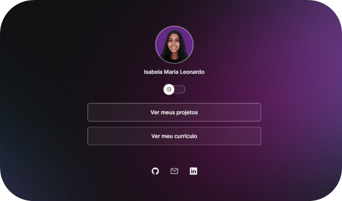
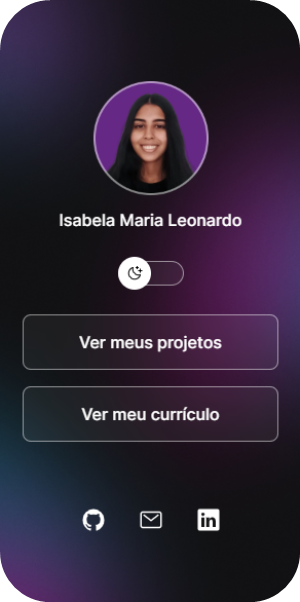
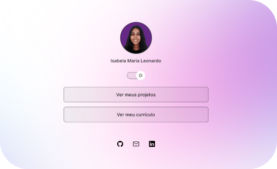
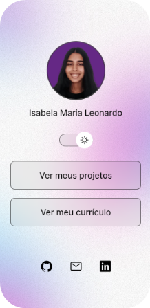

# Projeto DevLinks

O DevLinks é um agregador de links para usar como cartão de visitas online.

O Projeto foi desenvolvido durante o curso Discover, promovido pela Rocketseat.

Visualize o projeto finalizado, online:
[Clique AQUI](https://isabela-leonardo.github.io/DevLinks/).

## 📌 Índice

- [Layout](#-layout)
  - [Tela Desktop](#-tela-desktop)
  - [Tela Mobile](#-tela-mobile)
  - [Tela Desktop Light](#-tela-desktop-light)
  - [Tela Mobile Light](#-tela-mobile-light)
- [Tecnologias e Ferramenta utilizadas](#tecnologias-e-ferramenta-utilizadas)
- [Autor](#-autor)

## 🖥️ Layout

Você pode visualizar o layout do projeto através [DESSE LINK](https://www.figma.com/community/file/1187422022288947321). É necessário ter conta no Figma para acessá-lo.

### 📂 Tela Desktop

### 📂 Tela Mobile

### 📂 Tela Desktop Light

### 📂 Tela Mobile Light

## Tecnologias e Ferramenta utilizadas

   

## 📝 Autor

- Isabela Maria Leonardo
